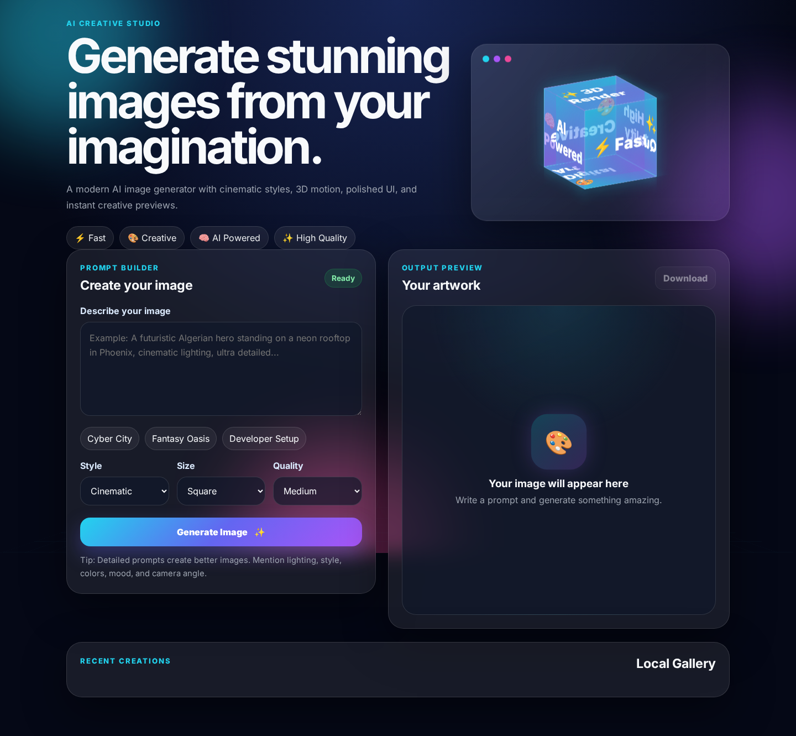
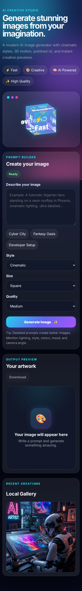

# 🤖 AI Image Generator

<div align="center">


### Create stunning AI-generated artwork with a modern 3D interface

<p>

<a href="https://YOUR-NETLIFY-URL.netlify.app">

</a>

<a href="https://github.com/achrafdev89/ai-image-generator">

</a>

<a href="https://linkedin.com/in/achraf-chibane">

</a>

</p>

</div>

---

## ✨ Features

* 🎨 AI-powered image generation
* ⚡ Fast image creation
* 🌈 Multiple artistic styles
* 🖼️ Download generated images
* 📱 Fully responsive design
* 💎 Glassmorphism UI
* 🚀 Modern animations and motion effects
* 🌌 3D interactive design elements
* 📚 Prompt presets
* 🖼️ Local image gallery

---

## 📸 Screenshots

### Home Screen



### Generated Artwork


### Mobile Experience



---

## 🎬 Live Demo Preview


---

## 🛠️ Tech Stack

### Frontend


### Backend


### AI


---

## 📂 Project Structure

```text
ai-image-generator
│
├── backend
│   ├── server.js
│   ├── package.json
│   └── .env
│
├── frontend
│   ├── index.html
│   ├── style.css
│   ├── script.js
│   └── assets
│
└── screenshots
```

---

## 🚀 Installation

### Clone the repository

```bash
git clone https://github.com/achrafdev89/ai-image-generator.git
```

### Install backend dependencies

```bash
cd backend
npm install
```

### Configure environment variables

```env
OPENAI_API_KEY=your_api_key
PORT=5000
```

### Start backend

```bash
npm run dev
```

### Start frontend

Open:

```text
frontend/index.html
```

or use VS Code Live Server.

---

## 🌐 Live Website

🚀 Live Demo:

https://visionforge-ash.netlify.app/

---

## 🗺️ Roadmap

* [x] AI image generation
* [x] Download images
* [x] Responsive UI
* [ ] User accounts
* [ ] Cloud gallery
* [ ] Image upscaling
* [ ] Style marketplace
* [ ] Community gallery
* [ ] Prompt sharing

---

## 👨‍💻 Author

### Achraf Chibane

<p>

<a href="https://github.com/achrafdev89">

</a>

<a href="https://linkedin.com/in/achraf-chibane">

</a>

</p>

---

⭐ If you like this project, give it a star on GitHub.
